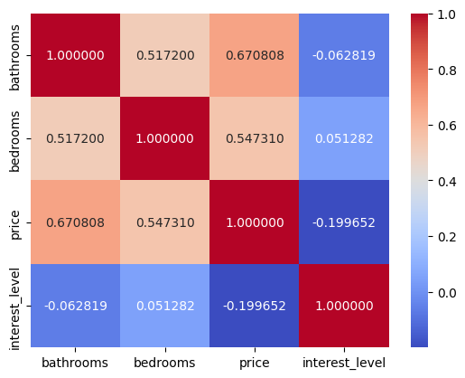

## Название
Rental Price Prediction with Machine Learning
## Описание
Проект посвящён прогнозированию цен аренды квартир на основе данных о характеристиках объявлений. Реализован полный процесс: исследовательский анализ данных (EDA), очистка, построение признаков, обучение нескольких моделей и сравнение их качества.
## Цель проекта
Изучить основные шаги в построении ML-модели.
Сравнить простые алгоритмы (линейная регрессия, дерево решений, наивные бенчмарки).
Сделать выводы о влиянии признаков на цену.
## Данные
Источник: Kaggle RentHop Dataset
Использованные признаки:
bathrooms
bedrooms
interest_level
price (target)
## Технологии 
Python 3.10
pandas, numpy
matplotlib, seaborn
scikit-learn
lightgbm 
## Этапы работы
EDA: размеры датасета, описание, корреляции
Очистка данных: удаление выбросов по перцентилям
Анализ признаков и кодировка категориальных данных
Создание дополнительных признаков
Обучение моделей: Linear Regression, Decision Tree, Naive models
Сравнение по MAE и RMSE
## Результаты
`MAE`
|model|	train|	test|
| :--- | :---: | :---: |
|linear_regression|	752.670568|	798.853594|
|decision_tree	|752.669057|	760.319019|
|naive_mean	|1131.815443|	1144.533690|
|naive_median|	1079.734162|	1092.166408|

`RMSE`
|model	| train	| test |
| :--- | :---: | :---: |
|	linear_regression	|1070.302933	|3959.230852|
|decision_tree	|1070.262495|	1074.556632|
|naive_mean|	1580.460676|	1606.034024|
|naive_median|	1626.873056|	1651.661962|

`Heat map корреляции признаков`

# Лучшая модель: Decision Tree Regressor